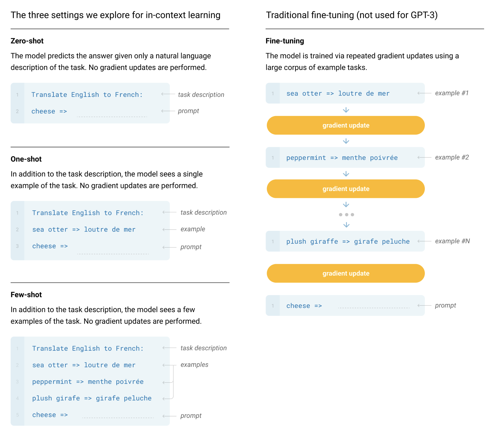

# GPT 1

## Overview (Abstract)
- Based on decoder of the transformer
- Improved by addressing the fact that the model architecture needs not to be changed for various tasks

## Intro
- It used to be word embedding models. 
- Previous techniques suffer from limited choice of the loss function
- Hard to transfer the representation to go to the downstream sub-tasks
- Proposed a semi-supervised approach
- Transformer based
  - For a more robust knowledge transfer
  - More structured Memory    
- Used task specific technique

## Framework

### Unsupervised pre-training
Setup: Given an unsupervised corpus of tokens U = {u1, ..., un} (with order information), a standard language modeling objective to maximise the following likelihood:
$$
    L_1(U) = \sum_i \log P(u_i | u_{i - k}, \ldots , u_{i - 1} ; \Theta)
$$

- In order to have natural order, we can only use decoder of the transformer architecture
- Then the current model architecture can be described as:
$$
  h_0 = UW_e + W_p \\
  h_l = \texttt{transformer\_block} (h_{l-1}) \; \forall i \in [1,n] \\
  P(u) = \texttt{softmax}(h_nW^T_e)
$$
- Difference to BERT: Can see both before and after

### Supervised fine-tuning
- Doing essentially the same thing as both but use the actual label rather than the next tokens.
- However, we will have a specific output matrix $W_y$
- Then, the $L_2$ objective can be trained together with the $L_1$ objective connected by the proportion $\lambda$ to control the weight of $L_1$.
$$
  P\left( y \middle| x^1, \ldots, x^m \right) = \text{softmax}\left( h_l^m W_y \right) \\
  L_2(C) = \sum_{(x, y)} \log P\left( y \middle| x^1, \ldots, x^m \right).
$$

### Common Problems Formulation

## Experiements
- For 7000 unpublished books
- 12-layer decoder-only transformer with masked self-attention heads

# GPT2
- Relatively less important
- Mainly just for improving the models accuracy
- However, they have focused on the zero-shot possibilities they have mentioned
  - This would imply that they would then require the downstream subtask to only use the existing langauges rather than the special termination characters they used in GPT1
  - Now, they have used English words as the terminators (which are later known as prompts)
- However, even though this allows for multi-task machine learning and beat most of the state-of-the-art multi-tasks models back then, they were unable to beat the domain specific (trained for specific tasks).
- The main improvment was that they were able to directly used the pre-trained model without fine-tuning for specific tasks perform multiple sub-tasks.

# GPT3: Language Models are Few-Shot Learners
- Even though GPT2 was very innovative, it wasn't very significant because of it lacks actual implementation.
- It is slightly impractical to have absolutely no traning samples for learning a subtasks.
  - This is very not human, and we still need to have some basic materials to learn the sub-tasks. 
  - It's just that human uses sample a lot more efficient than LLM
- No fine-tuning nor gradient updates for any sub-task training or fine-tuning

## Introduction
- Having to be highly accurate in the fine-tuning predictions does not really mean that your model has good generatlisation capability. It might have well enough to just be the model is "overfitting" to the training set but just that it is extremely large!
  - For example, using a lot of paragraphs in wikipedia, websites,...
- Separated into two phrases: Meta-learning & In-context learning 
  - Note that meta-learning is not the "meta-learning" that has been around for decades. In this literature, it simply means that it is a learning of the meta-information. Then, the in-context learning is simply learning in a specific context.
    - The main difference in practical is that meta-learning will have gradient updates and changing the weight, whereas "in-context learning" wont'. Note that "in-context learning" is more like giving more information in the inputs
    - In my prospective. This does describe how we learn very well... (Even though they have to overwrite the previous meaning.)
  
--------------- 

---------------

- Evaluate three conditions:
  - Few-shot learning: Have few learning (10 - 100)
  - One-shot learning: Only have one sample before the prediction tasks
  - Zero-shot learning: No sample before predictions

## Model Architecture
- Using the new sparse transformer

## Training Dataset
- In order for larger models, they have used a much larger dataset (Common Crowl).
- However, as they have mentioned in GPT2, this dataset is considered to be relativel dirty. Therefore, they needed to just clean up by checking if it is similar to redit.
- Also remove duplicate contents by using <ins>Local Sensitive Hash</ins>.

## Training Process
- Mixture of Model parallelism 
  - Matrix Multiplication
  - Model Parallelism across the layers of the network.
- Using DGX-1 Cluster

## Evaluation
- Prediction prompt is "Answer: " or "A: "
- For binary classification, then use "True" or "False" Rather than 0 or 1
- For free-form completion, they use beam search.

## Limitations
- Notable weakness in text synthesis and several NLP
  - Most of the times they are highly repeatable
- Structural and Algorithmic Limitations
  - Only one way with autor-regressive predictions
- All words are weighted equally currently
  - It does not understand that some of the words are less common in the language and some are more common in the language
  - No videos...
- Not efficient
  - Most of the things all the web are used
- Unsure if the current evaluation task is actually not in the training dataset.
  - It may possibly have similar tasks in the existing training dataset